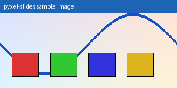

# Welcome to pyxel-slides

A retro Markdown presentation engine.

---

## What is it?

pyxel-slides converts Markdown into rendered **Pyxel** presentation slides.

Phase 2 adds **inline styling**, *italic text*, `inline code`, and
[hyperlinks](https://github.com/kitao/pyxel) — plus BDF fonts and a
typewriter reveal effect.

---

## Controls

- Right / Space: next slide (or skip typewriter reveal)
- Left / Backspace: previous slide
- Home / End: jump to first / last
- R: reload Markdown from disk
- Q / Esc: quit

---

## Inline styling

Normal text, **bold text**, *italic text*, and `inline code` all work.

You can also write **bold and *nested italic*** together.

Links look like this: [Pyxel on GitHub](https://github.com/kitao/pyxel).

---

## A code listing

```python
def fib(n):
    a, b = 0, 1
    for _ in range(n):
        a, b = b, a + b
    return a

print(fib(10))  # 55
```

Code panels use the **mono** Spleen font with a dark background.

---

# Section break!

Heading-only slides are centered and use the *large* Spleen font.

---

## Lists

1. Parse the **Markdown** source
2. Build a typed *IR* (intermediate representation)
3. Render with `pyxel.text()` using Spleen BDF fonts
4. Navigate with keyboard

Bullet list:

- GameBoy DMG 4-shade palette
- 384×216 landscape (16:9)
- Typewriter reveal (Space skips)
- Hot reload with **R**

---

## Font sizes (BDF)

### This is an H3 subheading

Regular body text appears below using Spleen 5×8.

Each heading level maps to a different Spleen size:
- H2 uses spleen-12x24
- H3 uses spleen-8x16
- body uses spleen-5x8

---

## Math rendering (Phase 5)

Block display math via `$$...$$`:

$$\int_0^\infty e^{-x^2}\,dx = \frac{\sqrt{\pi}}{2}$$

Inline math also works: the area of a circle is $\pi r^2$.

---

## Image dithering (Phase 4)

Images are loaded with Pillow, resized to fit, and Floyd-Steinberg dithered
to the **GameBoy 4-shade palette** automatically.



Syntax: ``

---

# Thanks!

Built on [Pyxel](https://github.com/kitao/pyxel) — the retro game engine.

